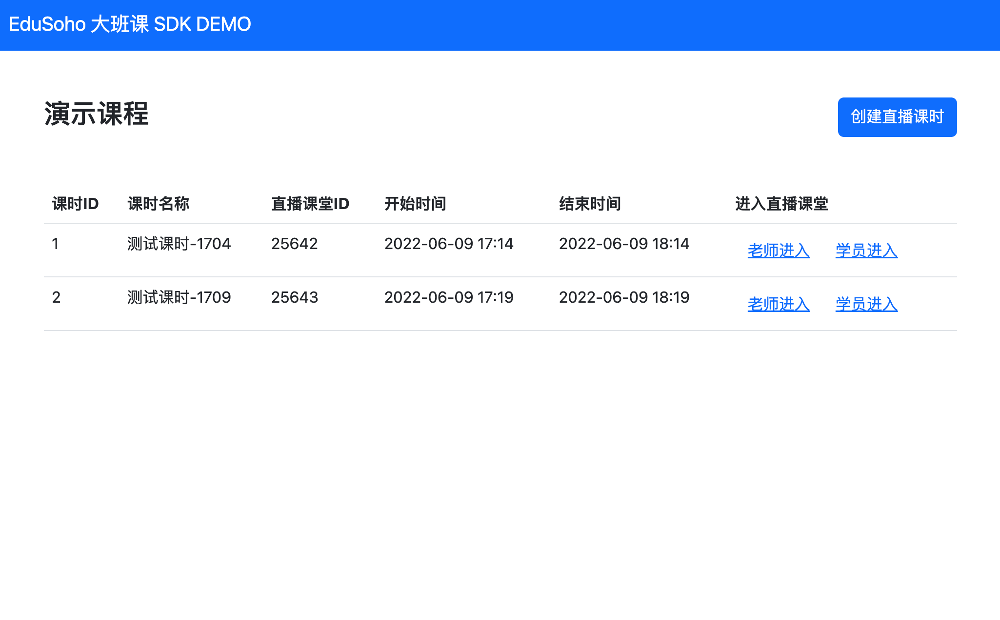

# EduSoho 大班课直播 SDK DEMO

## 下载代码

```shell
git clone https://github.com/edusoho-live/eslive-sdk-demo.git
```

## 配置 AccessKey / SecretKey

在 `src/main/resources` 目录下创建 `application-dev.properties`：

```
eslive.accessKey=
eslive.secretKey=
```

请在上述配置中填入您的 EduSoho云平台的 KEY。

## 运行DEMO

MacOS/Linux:
```shell
./mvnw spring-boot:run
```

Windows:
```
mvnw spring-boot:run
```

或者打开 IDE 运行，DEMO 程序基于 Spring Boot 开发。

**注意：DEMO程序使用的内存数据库，服务重启后，数据会清空。**

## 浏览器中打开

```
http://localhost:8801/index.html
```

看到如下界面，表示 DEMO 运行成功了！

